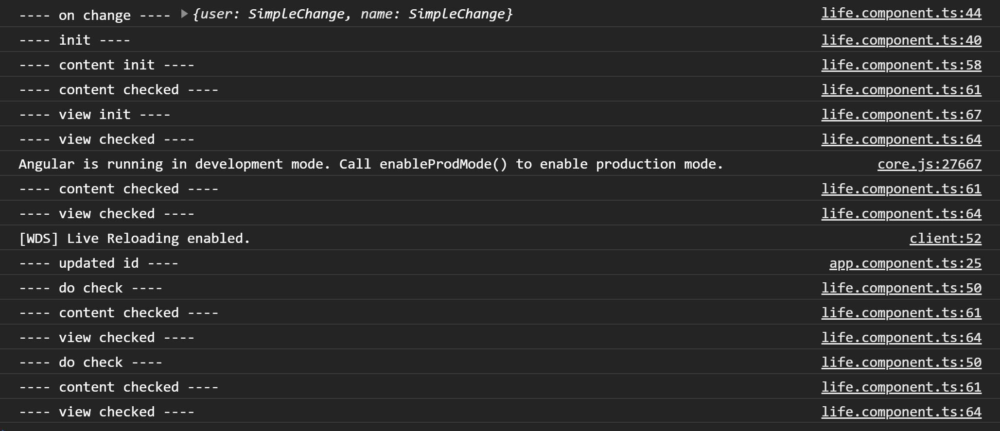

# AngularLifeDemo

This project was generated with [Angular CLI](https://github.com/angular/angular-cli) version 11.0.3.

### OnChanges 与 DoCheck
* OnChanges => 检测数据变更, 同步渲染到template.
* DoCheck => 生命周期角度来说是发生在OnChange之后的， 在ChangeDetectionStrategy.OnPush模式下， 只有输入属性变化才会被OnChanges监听到， 也就是说如果一个对象的引用没变化，单纯是对象的属性变化了，是不会反应到子组件的模板中的，这时可以用DoCheck来手动修改检查规则.

